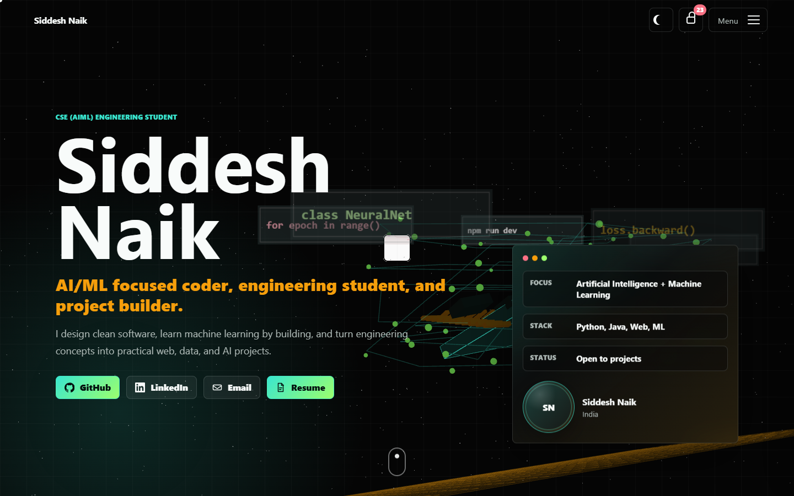
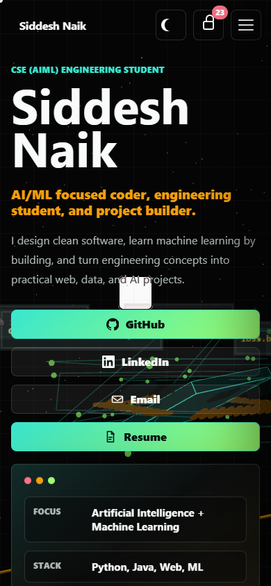

# Siddesh Naik 3D Editable Portfolio

A 3D animated engineering portfolio built with HTML, CSS, JavaScript, Three.js, Firebase Firestore, and Vercel. The site includes a hidden owner editor that can update portfolio text, links, skills, experience, projects, project images, profile photo, and resume PDF.





## Features

- Full-screen animated Three.js background.
- Responsive portfolio sections for hero, tech stack, experience, projects, profile, achievements, and contact.
- Owner edit mode protected by a special code.
- Editable resume PDF link with upload support.
- Editable project cards with project image upload support.
- Persistent deployed edits using Firebase Firestore.
- Uploaded images and resume files saved as chunked Firestore assets.
- Local JSON fallback for development.

## How Permanent Editing Works

When deployed on Vercel, the portfolio saves data outside the codebase:

- Portfolio content is saved in the Firestore document `portfolio/profile`.
- Uploaded files are saved as chunked Firestore documents under `portfolioFiles`.
- Visitors load the same saved portfolio data from Firestore.
- Open visitor tabs listen for Firestore updates and refresh the displayed content live.
- Changes made from owner mode are visible to everyone, even after redeploys.

Important: permanent deployed edits require Firebase Firestore rules that allow this site to read the profile and save owner-mode edits/uploads.

## Owner Mode

1. Open the portfolio.
2. Click the lock button in the header.
3. Enter the special code.
4. Default code: `23`.
5. Edit any field.
6. Changes autosave.

For production, update `DEFAULT_CODE` in `src/main.js` if you want a code other than `23`.

## Firebase Rules

Use Firebase console rules that match how much control you want. For a simple editable public portfolio, this permissive setup makes the live editor work immediately:

```text
rules_version = '2';
service cloud.firestore {
  match /databases/{database}/documents {
    match /portfolio/profile {
      allow read, write: if true;
    }
    match /portfolioFiles/{fileId} {
      allow read, write: if true;
      match /chunks/{chunkId} {
        allow read, write: if true;
      }
    }
  }
}
```

Because this app saves directly from the browser, the owner code is a UI lock, not a server secret. For stronger protection, add Firebase Auth later and restrict writes to your signed-in account.

## Run Locally

```bash
npm install
npm run dev
```

Open:

```text
http://127.0.0.1:4173
```

Local edits use the same Firebase project when Firestore is reachable. If Firebase is blocked locally, edits temporarily fall back to this browser.

## Deploy With Permanent Edits On Vercel

1. Push the project to GitHub.
2. Import the GitHub repo into Vercel.
3. Create a Firestore database in the Firebase project `portfolio-b7cba`.
4. Add Firestore rules that allow the portfolio profile and `portfolioFiles` assets to be read and updated.
5. In Vercel Deployment Protection, disable Vercel Authentication for the production site if visitors should access it publicly.
6. Redeploy the project.
7. Open the live site, unlock owner mode, edit content/uploads, and wait for `Saved for everyone`.
8. Open the site in another browser/device to confirm everyone sees the saved changes.

## Make This Your Own Portfolio

1. Fork this repository or clone it.

```bash
git clone https://github.com/corsal2006/Portfolio.git
cd Portfolio
```

2. Install dependencies.

```bash
npm install
```

3. Update the default portfolio data in `data/profile.json`.

Change:

- `name`
- `tagline`
- `role`
- `summary`
- `about`
- `email`
- `phone`
- `socials`
- `skills`
- `experience`
- `projects`
- `achievements`

4. Replace the resume.

Put your PDF at:

```text
resume.pdf
```

Or upload a resume later from owner mode.

5. Run locally and check the design.

```bash
npm run dev
```

6. Use owner mode for quick edits.

Click the lock button, enter `23`, and update your content from the browser.

7. Deploy to Vercel and configure Firebase Firestore.

This is the key step that makes browser edits permanent for everyone.

8. Change the owner code for your own deployment in `src/main.js`.

## Project Structure

```text
data/
  profile.json      Default local portfolio data
screenshots/
  desktop.png
  mobile.png
src/
  main.js           Portfolio rendering, Firestore saves/uploads, Three.js scene
  styles.css        UI styling
server.mjs          Local development server
resume.pdf          Default resume PDF
```

## Storage Notes

This project does not commit edits made from owner mode back to GitHub. Runtime edits and uploads belong in Firebase Firestore so they can be changed after deployment and shared with all visitors immediately.

GitHub stores the source code. Firebase stores live portfolio edits and uploaded media.
